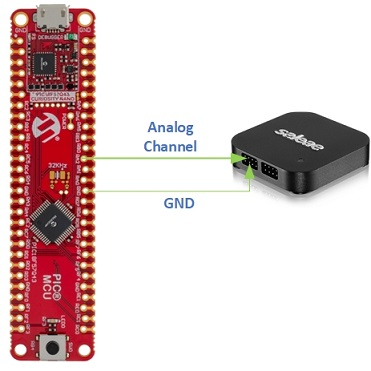
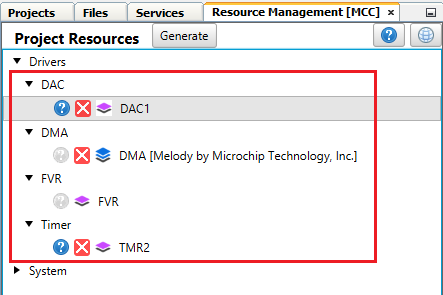
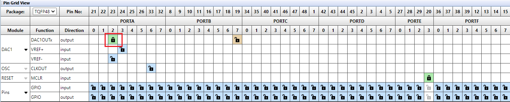

# Sine Wave Generation using DAC and DMA of PIC18F57Q43 Microcontroller

This code example demonstrates how to generate a 100 Hz sine wave without CPU intervention using the built-in DAC and DMA peripherals of the PIC microcontroller. Some compatible PIC18F-Q43 family of MCUs are: PIC18F27Q43, PIC18F47Q43, PIC18F57Q43.

## Related Documentation

- [PIC18F57Q43 Data Sheet](https://www.microchip.com/DS40002147F)

## Objective

This application example highlights the usage of 8-bit buffered DAC and DMA peripherals of PIC18F57Q43 microcontroller to generate a sinusoidal waveform. This device has a DMA module which can be used for seamless and direct data transfers between different memory regions without intervention from the CPU. The signal is generated by continuously adjusting the output of a DAC to create an analog signal made of a series of discrete steps. The values of DAC input data register are loaded from look-up table stored in Program Flash Memory using DMA.

In this application, DAC is configured to use FVR as the positive reference and ground as the negative reference. The frequency of  sine wave is decided by the frequency of updating DAC DATA register and total number of points/samples in one cycle of the signal. The number of data samples per cycle of the sine wave is set as 250 and is stored in a look up table in program flash memory. This data is transferred to DAC data register using DMA which is hardware triggered by Timer 2 overflow interrupt occurring every 40 µs. 

Therefore, frequency of signal, 
f = 1 / (Total no of samples per cycle * Timer 2 period) = 1/ (250 * 40µS) = 100 Hz. 

If we keep number of DAC samples in sine wave constant, then frequency of signal can be changed by changing Timer 2 period. DAC output is routed to pin RA2, and we can observe the output on logic analyzer/oscilloscope.

## Software Used

- MPLAB® X IDE [v6.00.0 or newer](https://www.microchip.com/mplab/mplab-x-ide)
- XC8 Compiler [v2.35.0 or newer](https://www.microchip.com/mplab/compilers)
- MPLAB® Code Configurator (MCC) [v5.1.0 or newer](https://www.microchip.com/mplab/mplab-code-configurator)
- MPLAB® Code Configurator (MCC) Device Libraries PIC10 / PIC12 / PIC16 / PIC18 MCUs [v5.7.0 or newer](https://www.microchip.com/mplab/mplab-code-configurator)
- Microchip PIC18F-Q series Device Support [v1.13.211 or newer](https://packs.download.microchip.com/)

## Hardware Used

- [PIC18F57Q43 Curiosity Nano Evaluation Kit](https://www.microchip.com/en-us/development-tool/DM164150)
- Logic analyzer/Oscilloscope

## Hardware Setup

This demo is implemented using PIC18F57Q43 Curiosity Nano Evaluation Kit. The sine wave generated on pin RA2 is observed on a logic analyzer/oscilloscope. Connect pin RA2 to analog channel of logic analyzer. Connect GND of CNANO to respective channel GND.

## Demo Operation

After the hardware connections are complete and firmware is programmed, you can observe the waveforms. The required measurement parameters such as frequency and period are added in the waveforms. A sine wave of 100 Hz frequency is generated using DAC and DMA.

## Peripheral Configuration

This section explains how to configure the peripherals using MPLAB X IDE with MCC plugin for recreation of the project. 

Refer Software Used section to install required tools to recreate the project.

Additional Links: [MCC Melody Technical Reference](https://onlinedocs.microchip.com/v2/keyword-lookup?keyword=MCC.MELODY.INTRODUCTION&version=latest&redirect=true)

| Peripherals               | Configuration                                                                                                                                                                                                                                                                                                                                                                                                  | Usage                                                                         |
|---------------------------|----------------------------------------------------------------------------------------------------------------------------------------------------------------------------------------------------------------------------------------------------------------------------------------------------------------------------------------------------------------------------------------------------------------|-------------------------------------------------------------------------------|
|     System Settings    |     Clock Control: Clock source -   HFINTOSC HF Internal Clock - 16MHz Clock Divider   – 1                                                                                                                                                                                                                                                                                                         |     16 MHz System  clock                                                                     |
|     TMR2               |     Enable Timer Control Mode - Roll over pulse Start/Reset Option - Software Control Clock Source - Fosc/4 Polarity - Rising edge Prescaler - 1:32 Postscaler - 1:1 Time Period - 40µs TMR Interrupt Enabled                                                                                                                                                                    |     Used to hardware trigger DMA                                           |
|     DAC1               |     Enable DAC DAC Positive reference selection - FVR DAC Negative reference selection - VSS DAC Output Enable Selection - DACOUT1 Enabled and DACOUT2 Disabled                                                                                                                                                                                                                              |     Used to generate 100Hz sine wave                                 |
|     DMA                |     DMA: DMA Dependency - DMA1 Source Address - 0x010000 Source Message Size - 250 Destination Region - SFR Destination Module -  DAC1 Destination SFR - DAC1DATL Destination Message Size – 1     DMA1:   DMA Enabled Source mode - Incremented Source region - Program Flash Destination mode - Unchanged Abort Trigger - None Start Trigger - TMR2       |     Used for data transfer between LUT in PFM and DAC DATA           |
|     FVR                |     FVR Enabled FVR_buffer 2   - 2x                                                                                                                                                                                                                                                                                                                                                                      |     Positive   reference voltage to DAC                                    |                                                                                                                                                                                                                                                                                                                                                                                           

- **System Settings**

 

- **Add DAC, DMA, FVR and TMR2 peripherals**

 

- **DAC**

 

- **DMA**

1. DMA module loaded 
2. Select DMA dependency as DMA1
3. Navigate to builder area 
4. Launch DMA1 
5. Configure all Options in DMA1
6. Click on DMA module and configure the settings

 

 

 

 

- **FVR**

 

- **TMR2**

 

 

- **Pin Grid View**

Verify DAC output on pin RA2

 

- **Pins**

Verify that pin RA2 is Analog

 

## Summary

The DAC and DMA peripherals of PIC18F57Q43 Microcontroller are used to generate a 100Hz frequency sine wave without the intervention of CPU.
