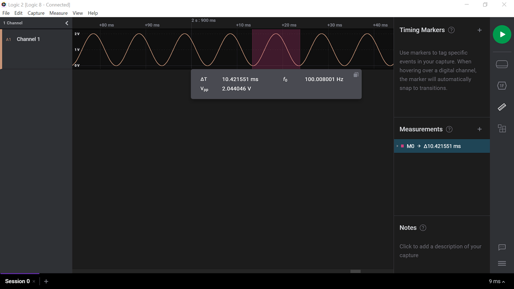

# Sine Wave Generation using Digital-to-Analog Converter (DAC) and Direct Memory Access (DMA) of PIC18F57Q43 Microcontroller

This code example demonstrates how to generate a 100 Hz sine wave without CPU intervention using the built-in DAC and DMA peripherals of PIC&#0174; microcontrollers. Some compatible PIC18F-Q43 family of MCUs are: PIC18F27Q43, PIC18F47Q43, PIC18F57Q43.

## Related Documentation

- [PIC18F57Q43 Data Sheet](https://www.microchip.com/DS40002147)
- [8-bit PIC MCU Peripheral Deep Dive](https://mu.microchip.com/8-bit-pic-mcu-peripheral-deep-dive-pub) (DAC Chapter)

## Objective

This application example highlights the usage of 8-bit buffered DAC and DMA peripherals of PIC18F57Q43 microcontroller to generate a sinusoidal waveform. This device has a DMA module which can be used for seamless and direct data transfers between different memory regions without intervention from the CPU. The signal is generated by continuously adjusting the output of a DAC to create an analog signal made of a series of discrete steps. The DAC values are loaded from a look-up table stored in Program Flash Memory (PFM) using DMA.

In this application, the DAC is configured to use the Fixed Voltage Reference (FVR) as the positive voltage reference and ground as the negative reference. The frequency of the sine wave is decided by how frequently the DAC DATA register is updated and the total number of samples in one cycle of the signal. The number of data samples per cycle of the sine wave is set as 250 and is stored in a look up table in PFM. This data is transferred to the DAC data register using DMA which is triggered by the Timer 2 overflow interrupt occurring every 40 µs.

Therefore, the frequency of the signal is:
`f = 1 / (Total no of samples per cycle * Timer 2 period) = 1/ (250 * 40µS) = 100 Hz`.

If the number of DAC samples in the sine wave is constant, the frequency of the signal can be changed by changing the period of Timer 2. The DAC output is routed to pin RA2, and can be observed using the output of an oscilloscope.

## Software Used

- [MPLAB® X IDE v6.20.0](https://www.microchip.com/mplab/mplab-x-ide)
- [XC8 Compiler v3.0.0](https://www.microchip.com/mplab/compilers)
- [MPLAB® Code Configurator (MCC) v5.7.1](https://www.microchip.com/mplab/mplab-code-configurator)
- [Microchip PIC18F-Q series Device Support (PIC18F-Q_DFP v1.26.442)](https://packs.download.microchip.com/)

## Hardware Used

- [PIC18F57Q43 Curiosity Nano Evaluation Kit](https://www.microchip.com/en-us/development-tool/DM164150)
- Logic Analyzer/Oscilloscope

## Hardware Setup

This demo is implemented using the PIC18F57Q43 Curiosity Nano Evaluation Kit. The sine wave generated on pin RA2 is observed on a logic analyzer/oscilloscope. Connect pin RA2 to any analog channel of logic analyzer. Connect the GND pin of the Curiosity Nano board to the ground pin of the logic analyzer/oscilloscope.

## Demo Operation

After the hardware connections are complete and firmware is programmed, the waveforms can be observed. The logic analyzer/oscilloscope is configured to measure frequency/period. A sine wave of 100 Hz frequency is generated using the DAC and DMA.

## Peripheral Configuration

This section explains how to configure the peripherals using MPLAB X IDE with MCC plugin for recreation of the project.

Refer to the [Software Used](https://github.com/microchip-pic-avr-examples/pic18f57q43-dac-dma-sinewave-generation-mplab-mcc#software-used) section to install required tools to recreate the project.

Additional Links: [MCC Melody Technical Reference](https://onlinedocs.microchip.com/v2/keyword-lookup?keyword=MCC.MELODY.INTRODUCTION&version=latest&redirect=true)

| Peripherals | Configuration | Usage |
| ----------- | ------------- | ----- |
| Clock Control | Clock Control: Clock source - HFINTOSC HF Internal Clock - 16MHz Clock Divider – 1 | 16 MHz System  clock | 
| TMR2 | Enable Timer Control Mode - Roll over pulse Start/Reset Option - Software Control Clock Source - Fosc/4 Polarity - Rising edge Prescaler - 1:32 Postscaler - 1:1 Time Period - 40µs TMR Interrupt Enabled  | Used to hardware trigger DMA |
| DAC1 | Enable DAC DAC Positive reference selection - FVR DAC Negative reference selection - VSS DAC Output Enable Selection - DACOUT1 Enabled and DACOUT2 Disabled   | Used to generate 100Hz sine wave   |
| DMA | DMA: DMA Dependency - DMA1 Source Address - 0x000000 Source Message Size - 250 Destination Region - SFR Destination Module - DAC1 Destination SFR - DAC1DATL Destination Message Size – 1     DMA1:   DMA Enabled Source mode - Incremented Source region - Program Flash Destination mode - Unchanged Abort Trigger - None Start Trigger - TMR2  | Used for data transfer between LUT in PFM and DAC DATA    | 
| FVR | FVR Enabled FVR_buffer 2 - 2x | Positive reference voltage to DAC |

## Summary

The DAC and DMA peripherals of PIC18F57Q43 Microcontroller are used to generate a 100Hz frequency sine wave without the intervention of CPU.
